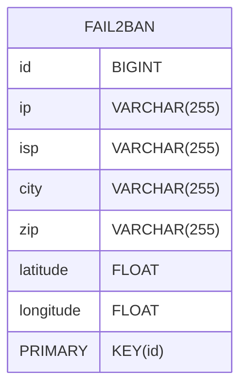

# Fail2ban-monitoring

## Datamodel

```mermaid
erDiagram
    FAIL2BAN {
        id BIGINT
        ip VARCHAR(255)
        isp VARCHAR(255)
        city VARCHAR(255)
        zip VARCHAR(255)
        latitude FLOAT
        longitude FLOAT
        PRIMARY KEY(id)
    }
```
